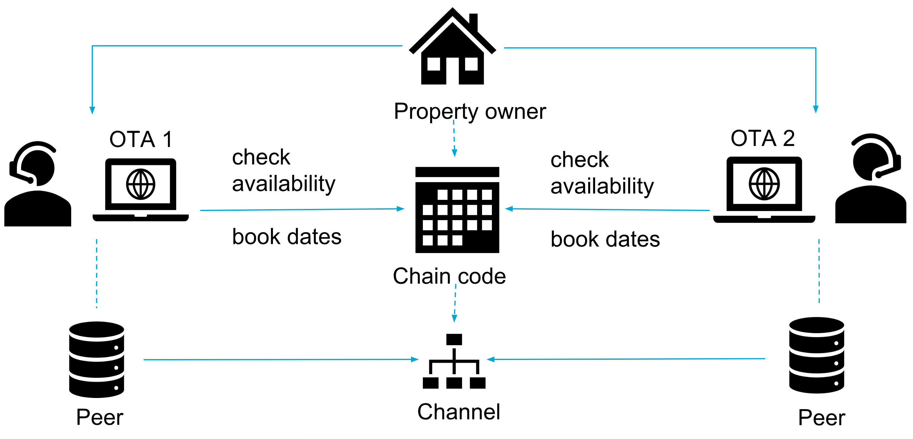
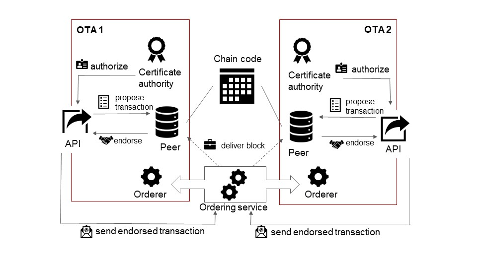
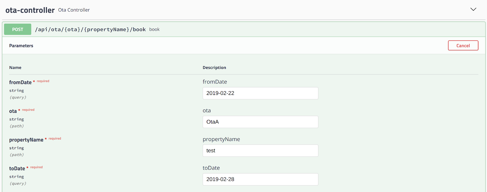
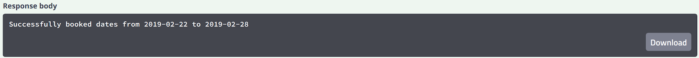
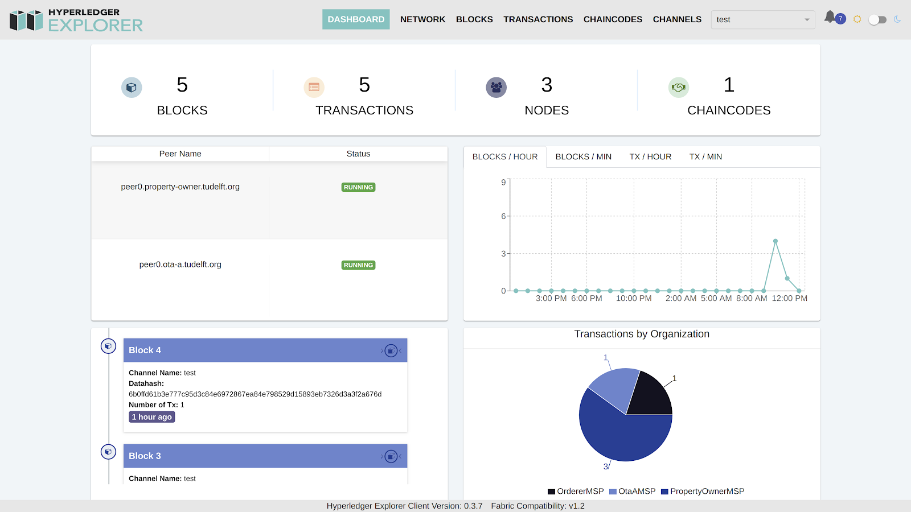

## Solving the Overbooking problem with Hyperledger Fabric

### **Problem**

Our team was presented with two problems: overbookings and government regulations, e.g. limiting the maximum amount of nights Property Owners can rent out their places each year. We have decided to focus only on the overbookings issue in order to be able to understand better the business case and build a suitable prototype. 

The overbookings problem appears when properties are listed on multiple Online Travel Agencies (OTAs), e.g. [Booking.com](https://www.booking.com), [Airbnb](https://www.airbnb.com/), etc. When a property is booked on any OTA platform, there is no mechanism to prevent booking it again on other OTAs' platforms. In order to provide synchronization between OTAs, collaboration among them is required. Such a partnership, though, demands to keep each OTA's specific business information private from their competitors.

The case has four main business requirements:

*   _Information sharing_: a way for OTAs to inform their competitors that given dates are no longer available after registering a booking
*   _Privacy_: only authorized parties, i.e. OTAs the owner decides to work with, can view and/or edit data regarding a certain property
*   _Anonymity_: the dates availability should be shared in such a way that other OTAs reading the information should not know which of their competitors is behind the booking
*   _Scalability_: the solution should be able to handle about 5 millions of transactions per day

There is no such integrated solution with privacy capabilities implemented at the moment.

### **Solution**

Exploring opportunities with blockchain allows for a distributed solution which could possibly help collaboration between OTAs, without revealing actual business data to competitors.

#### **Solution overview**

The high-level idea for the solution is quite simple (_Figure 1_). A Property Owner can have many properties. Each property is represented by a private channel. A private channel is a private "subnet" of communication between parties. Only OTAs that work with that property are allowed to modify data, i.e. book dates via a smart contract.

_Figure 1: Solution Overview_

A Property Owner can authorize OTAs to access this smart contract in order to check dates availability and perform bookings. The bookings are represented by transactions on the blockchain. Such authorization must also be revocable. For example, when a Property Owner no longer wishes to work with an OTA he should be able to revoke access of that OTA to the private channel of his property. No party outside that private channel (e.g. an OTA that does not work with that property and its owner) has any access to view or edit the data. All members of this channel should be able to query dates availability by reading the distributed ledger.

However, the issuer of the transaction, i.e. an OTA booking a date, does not want to share their identity with the other members of the channel. The only information that should be shared is the dates themselves. The reason being that it could leak business information to competitors about the number of bookings an OTA has. One solution to this issue is the Zero-Knowledge Proof (ZKP). In short, this allows a party to prove that they possess certain knowledge or permissions, without actually revealing these permissions or any sensitive information. Here, an OTA would provide a ZKP that it is one of the companies authorized to manage a certain property, without explicitly revealing their identity.

#### **Permissioned blockchains**

Public blockchains, like [Bitcoin](https://bitcoin.org/en/) or [Ethereum](https://www.ethereum.org/), are also called permissionless since anyone can join the network and issue transactions which will be written to the distributed ledger. Permissioned blockchains, on the other hand, require parties to be authorized to join the network, by other members or a governing organization. Once authorized they can read from or write to the ledger.

By assuming that the members of the network are trustworthy because they have been allowed to join the network, permissioned blockchains are able to opt for different ways to reach consensus than the global consensus protocols public blockchains use. These distributed protocols tend to be very expensive, in terms of computing power and system performance, and make public blockchain solutions very difficult to operate at scale.

Permissioned blockchains can use different protocols instead and offer higher scalability and performance, at the cost of having to manage the access control for participants. Given the needs for privacy, anonymity and the volume of transactions the network should handle, we look at different blockchain implementations available:

<table>
  <tr>
   <td>Blockchain
   </td>
   <td>Throughput (txs/sec)
   </td>
   <td>Privacy
   </td>
   <td>Anonymity
   </td>
   <td>Permissioned
   </td>
   <td>Owner offline
   </td>
  </tr>
  <tr>
   <td>
     <a href="https://bitcoin.org/en/">Bitcoin</a>
   </td>
   <td>7
   </td>
   <td>no
   </td>
   <td>no
   </td>
   <td>no
   </td>
   <td>yes
   </td>
  </tr>
  <tr>
   <td>
     <a href="https://www.tudelft.nl/technology-transfer/development-innovation/research-exhibition-projects/trustchain/">TrustChain</a>
   </td>
   <td>10,000
   </td>
   <td>yes
   </td>
   <td>no
   </td>
   <td>no
   </td>
   <td>no
   </td>
  </tr>
  <tr>
   <td>
     <a href="https://www.ethereum.org/">Ethereum</a>
   </td>
   <td>25 
   </td>
   <td>yes
   </td>
   <td>no
   </td>
   <td>no
   </td>
   <td>yes
   </td>
  </tr>
  <tr>
   <td>
     <a href="https://www.hyperledger.org/projects/fabric">Hyperledger Fabric</a>
   </td>
   <td>3500
   </td>
   <td>yes
   </td>
   <td>limited
   </td>
   <td>yes
   </td>
   <td>yes
   </td>
  </tr>
  <tr>
   <td>
     <a href="https://www.r3.com/corda-platform/">R3 Corda</a>
   </td>
   <td>178
   </td>
   <td>yes
   </td>
   <td>yes
   </td>
   <td>yes
   </td>
   <td>yes
   </td>
  </tr>
</table>

#### **Why did we choose Hyperledger Fabric?**

The fact that most of the Property Owners, that produce overbookings, are unreliable, also played a crucial role in our choice. Assuming that the Property Owner could be offline most of the time we looked for a solution that would not require them to constantly be active on the network.

Hyperledger Fabric is a blockchain framework implementation and one of the Hyperledger projects hosted by The Linux Foundation. At the time of writing, Hyperledger Fabric version is 1.4. The main reasons we chose Hyperledger Fabric is the promise of:

- [_Private channels_](https://hyperledger-fabric.readthedocs.io/en/latest/channels.html): in Fabric the network is divided into channels. Each channel has its own blockchain, accessible only to members of the channel. This provides the privacy aspect.

- [_Zero Knowledge Proof Authentication_](https://hyperledger-fabric.readthedocs.io/en/latest/idemix.html): Fabric supports actors of the network presenting ZKPs to validate that they are authorized to perform certain actions (e.g. executing a smart contract). This could provide the anonymity aspect.

- Can accommodate Property Owners being offline and still have transactions being issued by having the OTAs maintain the ledger when they are not.

- Can process 3500 tx/sec on a single channel, which could equate to around 300 million transactions per day. This would cover the volume of transactions that online bookings represent.

#### **Architecture**

In this part, more details about the [architecture](https://hyperledger-fabric.readthedocs.io/en/latest/arch-deep-dive.html) of a Hyperledger Fabric network and how we used it to implement our solution are going to be presented (_Figure 2_).

Assume an existing network having members for each OTA and a Property Owner. Each OTA has several nodes in the network, each serving a different purpose.

*   _[Certificate Authority (CA)](https://hyperledger-fabric-ca.readthedocs.io/en/release-1.4/users-guide.html#overview):_ because Hyperledger Fabric is a permissioned blockchain, certificate authorities are required in order to sign, issue and verify certificates for all actors on the network. Each participant of the network would need to have their own CA.
    *   Companies can use third-party providers as their CA like DutchGrid, implement their own, or deploy solutions such as OracleAS Certificate Authority Server. Alternatively, Hyperledger offers its own CA server implementation: fabric-ca.
*   _[Chaincode](https://hyperledger-fabric.readthedocs.io/en/release-1.4/smartcontract/smartcontract.html)_: in Hyperledger Fabric, smart contracts are called _chaincode_. A smart contract is a program, which is shared on the blockchain and can enforce rules that were programmed in them.
    *   _For example: verifying that a certain date is available for a booking transaction to be valid, otherwise, reject it._
*   _[Peers](https://hyperledger-fabric.readthedocs.io/en/release-1.4/peers/peers.html)_: in Fabric, different machines are connected to the network. Each must present certificates signed by an authorized organization in order to connect in the first place. _Peer nodes_ are the main type of nodes in a Fabric network. These nodes are responsible for maintaining the Ledger, i.e. the blockchain, by recording the transactions that are committed. Smart contracts must be installed on these peer nodes in order for them to execute their functions.
*   _Orderers_: for the peer nodes to maintain the ledger, the transactions that they record must be ordered, with a way to reach consensus on this order. This is the role of the _orderer nodes_ that constitute the _ordering service_. Valid transactions are sent to this ordering service which decides on their order and sends them in the form of blocks to the peer nodes which add them to the existing chain.
    *   The orderer nodes can be backed by a Kafka / Zookeeper deployment to provide total ordered message brokerage with higher performance and scalability. The ordering service can be run by a separate organization or distributed across all OTAs that will run it collectively.

_Figure 2: Architecture overview_

**Transaction flow**

The flow of a Fabric [transaction](https://hyperledger-fabric.readthedocs.io/en/latest/txflow.html) is described in detail below and is shown in _Figure 3_. 

1. Propose a new transaction on a channel:
*   Client application creates a transaction proposal (invoke a chaincode function)
*   Client sends the transaction proposal to the peer nodes connected to the channel
2. Collect transaction endorsements:
*   Peer nodes simulate the transaction to check if it would result in a valid state
*   Peer nodes return an Endorsement to the client if the simulation is successful
3. Send the validated transaction:
*   Client assembles the transaction proposal and the required endorsements into a valid transaction
*   Client sends the valid transaction to the ordering service
4. Commit the transaction:
*   Ordering service checks the transaction endorsements
*   Ordering service assembles valid transactions into a block
*   Ordering service delivers the new block to the peer nodes
5. Peer nodes receive the new block and append it to the ledger

_Figure 3: Fabric transaction flow_

#### **Anonymity in Hyperledger 1.4**

In order to provide anonymity for the users of the blockchain network, Hyperledger Fabric 1.4 offers an identity mixer module called [Idemix](https://hyperledger-fabric.readthedocs.io/en/latest/idemix.html). This module is integrated with their fabric-ca server implementation. It can be used to obtain Idemix credentials instead of traditional certificates. 

An Idemix credential is very similar to classic X.509 certificates widely in use nowadays: a set of attributes is signed with a signature that is tied to a secret key and cannot be forged and can be verified using a public key. The difference lies in the signature scheme used to construct the credentials. With Idemix credentials, a user can generate a proof that his credentials' attributes meet a certain condition without disclosing those attributes. This is a typical example of Zero-Knowledge proof (ZKP). 

Transactions signed by Idemix and committed to Fabric blockchain are unlinkable: even though a given user did create and sign two given transactions, other members of the network cannot recognize whether those records created by the same user.

Hyperledger Fabric's Idemix, therefore, promises all necessary conditions regarding anonymity for the problem at hand: a user (OTA) can issue transactions (book dates) without other members of the network being able to establish their identity. 

Members use the cryptographic proof to verify that the particular OTA is authorized to perform the specified actions. One cannot tell that different transactions, signed by a given OTA using this method, were in fact signed by the same OTA either. 

Further development and improvement of Idemix is a work in progress. In particular, support for hiding the user's organization is an open issue, planned for implementation in a future release by the Fabric development team (Idemix selective attribute disclosure: [FAB-12759](https://jira.hyperledger.org/browse/FAB-12759) and [FABJ-154](https://jira.hyperledger.org/browse/FABJ-154)).

Although the current implementation of Hyperledger Fabric does not deliver certain features that are of particular interest to this case, they are part of the design and will be available in the future. This is the reason why we decided to not focus on finding a workaround for this problem. The implications for the prototype network we present here is that an OTA can, in fact, see who issued the transactions in a channel.

When the features are released by Hyperledger Fabric, updating the network to that version of Fabric would allow to implement the desired anonymity behaviour and solve this issue.

#### **Detailed workflow overview**

Following is an example scenario depicting how all the elements work together to reach the blockchain solution we are proposing. Operations with the blockchain are done via [the Java webapp](/ota-webapp).

For this scenario, we assume a running Hyperledger Fabric network. Every organization has its own set of peer nodes, CAs, and databases for storing the ledger. The network is started using [a set of configuration files and operations](booking-network-config).

_Figure 4 API UI with Swagger_

When a Property Owner registers his property by using [the REST API](ota-webapp/src/main/java/org/tudelft/blockchain/booking/otawebapp/endpoint/PropertyOwnerController.java#L20), a [private channel is created](ota-webapp/src/main/java/org/tudelft/blockchain/booking/otawebapp/service/hyperledger/ChannelService.java#L47). Each channel has its own ledger. Within it, only parties, who have joined it can issue transactions. An example of this is shown in _Figure 4_ and _Figure 5._ After the channel is created, the Property Owner joins it and installs the chaincode on its peers (if not done already). The state of the channel is stored locally on the peer, in our case - a CouchDB instance.

_Figure 5: Sample response from the Chaincode_

The next step is when an OTA is [joins the channel](ota-webapp/src/main/java/org/tudelft/blockchain/booking/otawebapp/service/PropertyService.java#L30). Before that moment every transaction should yield an "Access denied" response. When joining the channel, the OTA connects one (or more) of its peer nodes to it and the [chaincode is installed](ota-webapp/src/main/java/org/tudelft/blockchain/booking/otawebapp/service/hyperledger/ChainCodeService.java#L34) (if not already). 

The peer then fetches a copy of the whole ledger of that channel and the OTA can now book dates for the property, represented by the channel. The same procedure occurs for every organization willing to join a channel. When an organization invokes the chaincode, the transaction flow presented in _Figure 3_ starts.

The [chaincode](overbooking) has [one method](overbooking/src/main/java/org/tudelft/blockchain/booking/OverbookingChainCode.java#L49), which according to arguments provides two features. The first one is for [checking if a date range is available for booking](overbooking/src/main/java/org/tudelft/blockchain/booking/OverbookingChainCode.java#L123), and the second one for actually [booking them](overbooking/src/main/java/org/tudelft/blockchain/booking/OverbookingChainCode.java#L102).

To authenticate, an organization needs to get a certificate, [issued by that organization's CA](ota-webapp/src/main/java/org/tudelft/blockchain/booking/otawebapp/service/OrganizationCredentialService.java#L92). That certificate proves that the issuer is indeed part of an authorized organization to the other members of the channel.

With Idemix' current implementation anonymity within the channel extends only to which member of an organization is issuing the transaction. Hiding which organization this user belongs to is not currently supported, that part of our implementation is not possible.

### **Experiments**

Our initial testing and verification involved only manual testing using our REST API. Its usage is showcased in _Figure 4_ and _Figure 5._ We also used a tool, provided by Hyperledger - Hyperledger Explorer (shown in _Figure 6_), which displays the actual transactions contained in the blocks that were added to the blockchain. 

Afterwards, we decided to write a functional test over an integration test, as it most resembles a real use case for our solution: all components of the network were running, and the API calls were sent to the HTTP endpoints.

_Figure 6: Sample view of Hyperledger Explorer_

We were provided with a sample dataset consisting of 50 properties and 500 bookings on which we ran the functional test. 266 of the bookings were detected as overbookings and therefore rejected by the network as invalid transactions. The results were verified by a simple unit test, that traversed the dataset and counted the overbookings.

<table>
  <tr>
   <td>Dataset (bookings/ properties)
   </td>
   <td>Test setup time (avg of 3 executions)
   </td>
   <td>Response time (for all bookings)
   </td>
   <td>Seconds between sending transactions
   </td>
   <td>Detected overbookings
   </td>
  </tr>
  <tr>
   <td>500/50
   </td>
   <td>3 m 30 s
   </td>
   <td>130 s
   </td>
   <td>2.5 s
   </td>
   <td>266
   </td>
  </tr>
  <tr>
   <td>500/50
   </td>
   <td>3 m 30 s
   </td>
   <td>130 s
   </td>
   <td>1 s
   </td>
   <td>264
   </td>
  </tr>
  <tr>
   <td>500/50 reordered
   </td>
   <td>3 m 30 s
   </td>
   <td>130 s
   </td>
   <td>< 1 s
   </td>
   <td>266
   </td>
  </tr>
</table>

We have discovered that the time needed between transaction entering the ledger and consistently detecting an overbooking, is 2.5 seconds. Testing with lower time thresholds returned inconsistent numbers, due to the nature of communication between peers in the network and the time needed to disseminate information among them (i.e. gossiping).

Average times and response times are consistent.

We ran a second experiment, for which we modified the order of the entries in the experimental dataset. No two entries in the dataset are concerning the same property, meaning that there is some time between requests to the same channel. The performance improved more than twice. We could get consistent results with a pause of a little _below 1 second_.

The tests were performed on a single machine, running on Ubuntu 18.04 with 16GB RAM, and an 8th generation Intel Core i7 processor.

The setup consisted of a total of 13 containers for the 3 OTAs: 

*   3 x 1 peer node 
*   3 x 1 CouchDB instance for the peer to store the blocks
*   3 x 1 Chaincode instance
*   3 x 1 CA server
*   1 common orderer node running the ordering service for the network. 

### **Thoughts on scalability**

In order to handle a transaction volume of 5 million bookings per day, the setup would need to be scaled up for higher availability and fault tolerance.

Each OTA would deploy more peer nodes, each connected to a small number of channels. With fewer channels to maintain, each of the peer nodes would effectively provide higher throughput for the corresponding chaincodes. This would also introduce redundancy of peers, which would be helpful in case of failure of a peer.

Increasing the computing power of a peer node helps reduce the time it takes to execute the cryptographic operations needed to validate signatures. This would improve the effective time required to query dates availability for the first time.

Another option is adding a caching layer so that the number of requests is minimized. For example, if an OTA knows that certain dates are already booked, there is no point in querying the blockchain again to get the results.

The ordering service would need to be scaled following the same steps that are required to scale a Kafka message broker deployment with the different channels as its topics.

### **Lessons learned**

#### **Major issues with Hyperledger Fabric 1.4**

*   A Hyperledger Fabric network is hard to setup - not enough documentation and support, examples are trivially simple
*   Fabric not mature - implementation limitations (e.g. Idemix)

#### **General comments**
We have encountered the "enterprise" problem. We were either moving smoothly to the next step or very stuck. This is due to the fact that organizations, access control policies and certificate authorities are defined in configuration files. In those files, there is no validation whatsoever and in case we messed up something, it took a lot of time to find what is wrong. The error was not always clear and we took the approach of trial and error until we fix the issues.

Some exceptions were not very informative. However, that turned out to be a design decision on Fabric's part. They are sometimes switching log messages with generic ones in order to prevent information leaks if someone is looking through the logs. That problem was solved for us with debugging the actual SDK or checking the logs of the actual Docker containers. The behaviour is a design decision described in this ticket: [Unclear and generic error message](https://jira.hyperledger.org/plugins/servlet/mobile#issue/FAB-7952).

The footprint for an organization is (a minimum of) 5 Docker containers (min. 1 Peer, 1 Orderer, 1 CouchDB instance for storing the ledger, 1 CA node and 1 instance of the chaincode).

#### **Various Issues and difficulties**

1. In the beginning, we were with the impression that chaincode needs to be instantiated for every channel (in our case channel represents a property). This was causing the creation of multiple Docker containers (as many properties as we had in our tests). Then we discovered that we need the chaincode installed on every peer, instantiated once per channel by one peer and the important fact that there is only one Docker container per peer (and it is used for each channel where the chaincode is instantiated).
2. We were using only one CouchDB instance for all peers in our network, which is conceptually wrong. There should be a separate CouchDB instance per peer.
3. The hyperledger SDK is lacking proper documentation. There is only one end to end test which was our main source of information.
4. When installing the chaincode through the SDK, it required setting a manifest file, needed by the CouchDB. Since there were very few examples, it took quite some time to actually find out the needed content of the file. We discovered this again by trial and error.
5. We have sent two bookings for the same property one after another (the second of which is an overbooking attempt) with a difference of less than 1s. In this case, the overbooking was not detected and the transaction was added to the ledger. In the logs, we discovered that a PHANTOM_READ error appeared on the peers and the transaction was marked as invalid by them. Nevertheless, the ordering service broadcasted it and it was appended to the chain.
6. Communication with the dev team was possible but challenging. Their [Rocket chat](https://chat.hyperledger.org/), especially the _fabric-ca_ was flooded with irrelevant and obvious questions. However, we still managed to get in touch with some people form their team, e.g. about [Idemix enrollment](https://chat.hyperledger.org/channel/fabric-ca?msg=BFSHJkzaX6N5Hg29n) or a [Java SDK discuusion](https://chat.hyperledger.org/channel/fabric-sdk-java?msg=Sw6uBDX6QtGX3iArW).

### **Conclusion**

Issues such as cumbersome setup of a Fabric network, scarce documentation and simplistic examples lead to development mainly driven by trial and error. Implementing such a system without a dedicated consultant would be a huge challenge. Functionalities, which have not yet been fully implemented stand in the way of fully utilizing the technology's potential. Even though Hyperledger Fabric shows great promise, it is not yet mature enough to sustain a production ready system which covers all our business requirements.

### Blockchain Engineering [CS4160]

### TU Delft

#### February 2019

* Antal Száva, 4958489
* Berenger Nguyen Nhon, 4956125
* Maryam Tavakkoli, 4956222
* Milko Mitropolitsky, 4958543
* Viktoriya Kutsarova, 4958551

<!-- Docs to Markdown version 1.0β15 -->
