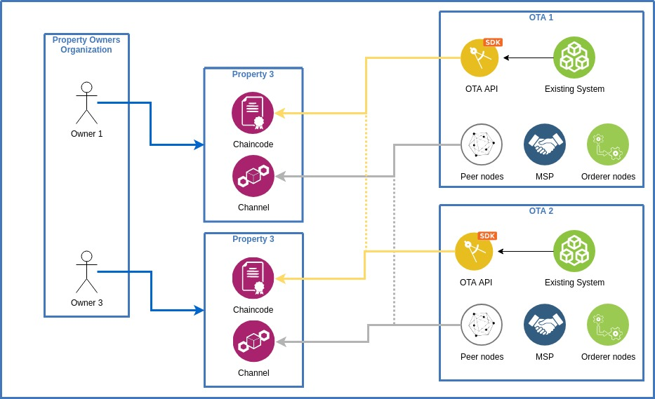
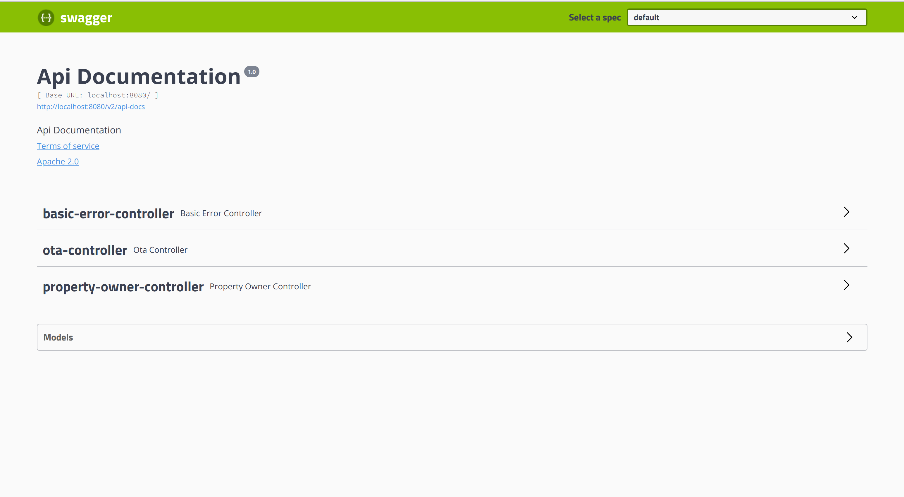
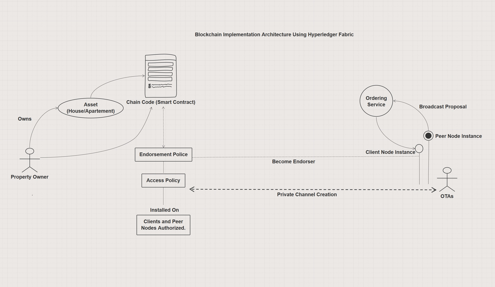

## Solving the Overbooking problem with Hyperledger Fabric

### Blockchain Engineering [CS4160]

### TU Delft

### February 2019

* Antal Száva

* Berenger Nguyen Nhon

* Maryam Tavakkoli, 4956222

* Milko Mitropolitsky

* Viktoriya Kutsarova

## Problem

Our team was presented with two problems - overbookings and night-cap problem. We have decided to focus only on the overbookings issue in order to be able to understand better the business case and build a suitable prototype.

The overbookings problem appears when properties are listed on multiple Online Travel Agencies (OTAs), e.g. Booking.com, Airbnb, etc. When a property is booked on any OTA platform, there is no mechanism to prevent booking it again on another platform. Currently, information synchronization between OTAs is either non-effective or generally non-existent.

## Solution

Exploring opportunities with blockchain allows for a distributed solution which could possibly help collaboration between OTAs, without revealing actual business data.

### Overview

The high-level idea for the solution is quite simple. Each property, is represented by a private channel. Only OTAs that work with that property are allowed to modify data, i.e. book dates via a smart contract.

A property owner (PO) can authorize OTAs to access this smart contract in order to check dates availability and perform bookings. The bookings are represented by transactions on the blockchain. Such authorization must also be revocable. No party outside that private channel (e.g. an OTA that does not work with that property and its owner) has any access to view or edit the data. All members of this channel should be able to query dates availability by reading the distributed ledger.

However, the issuer of the transaction, i.e. an OTA booking a date, does not want to share their identity with the other members of the channel. The only information that should be shared is the dates themselves. The reason being that it could leak business information to competitors about the number of bookings an OTA has. One solution to this issue is the Zero-Knowledge Proof (ZKP). In short, this allows a party to prove that they possess certain knowledge or permissions, without actually revealing these permissions or any sensitive information. Here, an OTA would provide a ZKP that it is one of the companies authorized to manage a certain property, without explicitly revealing their identity. 

### Permissioned blockchains

Unlike open blockchains like Bitcoin, or Ethereum, where anyone with sufficient resources could enter and issue transactions which would be written to the distributed ledger, permissioned blockchains allow only authorized parties, with certain credentials, to read from or write to the ledger. By assuming that the members of the network are trustworthy because they have been allowed to join the network, permissioned blockchains are able to opt for different ways to reach consensus than the global consensus protocols public blockchains use. These distributed protocols tend to be very expensive, in terms of computing power and system performance, and make public blockchain solutions very difficult to operate at scale.

Permissioned blockchains take a different approach to solve this particular issue.

### Why did we choose Hyperledger Fabric?

Given the assumptions about having private channels and zero-knowledge proofs, we looked into different options. The fact that most of the property owners, that produce overbookings, are unreliable, also played a crucial role in our choice. Another reason was the option to have the PO offline most of the time.

The main reasons we chose Hyperledger Fabric is the promise of:

*   Private channels
*   ZKPs
*   Supports the property owners being offline most of the time

<table>
  <tr>
   <td>
<strong>Blockchain</strong>
   </td>
   <td><strong>Scalability (txs/sec)</strong>
   </td>
   <td><strong>Anonymity</strong>
   </td>
   <td><strong>Permissioned</strong>
   </td>
   <td><strong>Owner offline</strong>
   </td>
  </tr>
  <tr>
   <td>Bitcoin
   </td>
   <td>7
   </td>
   <td>no
   </td>
   <td>no
   </td>
   <td>yes
   </td>
  </tr>
  <tr>
   <td>TrustChain
   </td>
   <td>10,000
   </td>
   <td>no
   </td>
   <td>no
   </td>
   <td>no
   </td>
  </tr>
  <tr>
   <td>Ethereum
   </td>
   <td>25 (promised to be increased with sharding)
   </td>
   <td>no
   </td>
   <td>no
   </td>
   <td>yes
   </td>
  </tr>
  <tr>
   <td>Hyperledger
   </td>
   <td>3500
   </td>
   <td>limited
   </td>
   <td>yes
   </td>
   <td>yes
   </td>
  </tr>
</table>

### Architecture

In this part, more details about the architecture of a Hyperledger Fabric network and how we used it to implement our solution are going to be presented.

Assume an existing network having members for each OTA and a Property Owner. For short we would call them Organizations. Each organization has several nodes in the network, each serving a different purpose.

*   _Certificate Authority (CA):_ because Hyperledger Fabric is a permissioned blockchain, certificate authorities are required in order to sign, issue and verify certificates for all actors on the network. Each organization that is part of the network would need to have their own CA.
*   _Chaincode_: in Hyperledger Fabric, smart contracts are called _chaincode. _A smart contract is a program, which is shared on the blockchain and can enforce rules that were programmed in them. 
    *   _For example: _verifying that a certain date is available for a booking transaction to be valid, otherwise, reject it_._
*   _Peers_: in Fabric, different machines are connected to the network. Each must present certificates signed by an authorized organization in order to connect in the first place. _Peer nodes_ are the main type of nodes in a Fabric network. These nodes are responsible for maintaining the Ledger, i.e. the blockchain, by recording the transactions that are committed. Smart contracts must be installed on these peer nodes in order for them to execute their functions. 
*   _Orderers_: for the peer nodes to maintain the ledger, the transactions that they record must be ordered, with a way to reach consensus on this order. This is the role of the _orderer nodes_ that constitute the _ordering service_. Valid transactions are sent to this ordering service which decides on their order and sends them in the form of blocks to the peer nodes which add them to the existing chain.

_Figure 1: Architecture overview_

The flow of a Fabric transaction is described in detail below and is shown in _Figure 2_. \
1. Propose a new transaction :

*   Client application creates a transaction proposal (invoke a chaincode function)
*   Client sends the transaction proposal to the peer nodes connected to the channel

2. Collect transaction endorsements :

*   Peer nodes simulate the transaction to check if it would result in a valid state
*   Peer nodes return an Endorsement to the client if the simulation is successful

3. Send the validated transaction:

*   Client assembles the transaction proposal and the required endorsements into a valid transaction
*   Client sends the valid transaction to the ordering service

4. Commit the transaction:

*   Ordering service checks the transaction endorsements
*   Ordering service assembles valid transactions into a block
*   Ordering service delivers the new block to the peer nodes

5. Peer nodes receive the new block and append it to the ledger

_Figure 2: Fabric transaction flow_

In order to provide anonymity for the users of the blockchain network, Hyperledger Fabric offers an identity mixer module called Idemix. An Idemix credential is very similar to classic X.509 certificates widely in use nowadays: a set of attributes is signed with a signature that is tied to a secret key and cannot be forged and can be verified using a public key. The difference lies in the signature scheme used to construct the credentials. With Idemix credentials, a user can generate a proof that his credentials' attributes verify a certain condition without disclosing those attributes, presenting a ZKP on said condition. Transactions committed to Fabric blockchains that are signed with Idemix credentials are unlinkable: even though a given user did create and sign two given transactions, other members of the network cannot establish that the same user was behind these transactions by examining the blocks of the chain containing them. 

Hyperledger Fabric's Idemix, therefore, promises all necessary conditions regarding privacy and anonymity for the problem at hand: a user (OTA) can issue transactions (book dates) without other members of the network being able to establish their identity, they can only verify the cryptographic proof that it is one of the authorized OTAs. Their identity cannot be leaked by analyzing the proportion of bookings in the blockchain either, because of the unlinkability. Further development and improvement of Idemix is a work in progress. In particular, support for hiding the user's organization is an open issue, planned for implementation in release 2.0. 

Although the current implementation does not deliver the features that are of particular interest to this case, they are part of the design and will be available in the future. This is the reason why we decided to not focus on finding a workaround of this problem. The implications for the solution is that an OTA can see who issued the transactions in a channel - a share of bookings per property can be identified.

### Workflow overview

Following is an example scenario depicting how all the elements work together in order to reach the solution we are proposing. 

Assuming an existing network. Every organization has its own set of peer nodes, CAs, and databases for storing the ledger. 

When a property owner creates a property, a private channel is created. Each channel has its own ledger. Within it, only parties, who have joined it can issue transactions. After the channel is created, the PO joins it and installs the chaincode on its peers if this is not done already.  The (possible) installation starts up a Chaincode node, which will then be shared for every instance of the chaincode, i.e. every property that PO creates. As a member of the channel, the PO can book dates as well on his own. The state of the channel is stored locally on the peer, in our case CouchDB.

The next step is when an OTA joins the channel. Before that moment every transaction should yield an "Access denied" response. When joining the channel, a similar process occurs to the one for the creator of the channel. The chaincode is installed (if not already) and is instantiated. The whole ledger of that channel is copied to the local CouchDB instance and the OTA can now book dates for the property, represented by the channel. Information about members of the channel is disseminated to all other members via an anchor peer - and best practice is that each organisation has at least one anchor peer. The same procedure occurs for every organization willing to join a channel. When an organization invokes the chaincode, a transaction of the type presented in _Figure 2._

To authenticate, an organization needs to get a certificate, issued by that organization's CA. That certificate proves that the issuer is indeed part of an authorized organization in front of the other members of the channel.

With Idemix' current implementation anonymity within the channel extends only to which member of an organization is issuing the transaction. Hiding which organization is the creator of the transaction is still not realised and currently, that part of our implementation is not possible. The initial promise of Hyperledger to have the complete Attribute based ZKP is not implemented as of the latest version 1.4, but it is in the pipeline for future releases.

_Figure 3: Swagger UI

## Learnings

### Major issues

*   Hard to setup - not enough documentation and support
*   Technology not mature - implementation limitation (e.g. Idemix)

### Simulation

We have performed a simulation with a dataset containing 500 bookings, 266 out of which were overbookings. We have discovered that the time needed between transaction entering the ledger and detecting an overbooking, is 2.5 seconds. 

The footprint for an organization is (a minimum of) 5 docker containers (min. 1 Peer, 1 Orderer, 1 CouchDB instance for storing the ledger, 1 CA node and 1 instance of the chaincode).

### Setup

We have encountered the "enterprise" problem. We were either moving smoothly to the next step or very stuck. This is due to the fact that organizations, access control policies and certificate authorities are defined in configuration files, In those files there is no validation whatsoever and in case we messed up something, it took a lot of time to find what is wrong. The error was not always clear to us and we took the approach of trial and error until we fix the issues.

### Various Issues and difficulties

1.  In the beginning, we were with the impression that chaincode needs to be instantiated for every channel (in our case channel represents a property). This was causing the creation and start of plenty of docker containers (as many properties as we had in our tests). Then we discovered that we need the chaincode installed on every peer, instantiated once per channel by one peer and the important fact that there is only one docker container per peer (and it is used for each channel where the chaincode is instantiated).
1.  We were using only one CouchDB instance for all peers in our network, which is conceptually wrong. There should be a separate CouchDB instance per peer.
1.  The hyperledger SDK is lacking proper documentation. There is only one end to end test which was our main source of information.
1.  When installing the chaincode through the SDK, it required setting a manifest, needed by the CouchDB. We discovered this by trial and error again.

## Statement

Even though the technology shows great promise, it is not yet mature enough to sustain a production ready system which covers all our business requirements. Implementing such a system without a dedicated consultant would be a huge challenge.

<!-- Docs to Markdown version 1.0β14 -->

# Blockchain Booking

## Overview

For details about the business case itself, see [Problem description](docs/problem_description/problem_description.md)

We chose to focus on the **Overbooking** sub-problem, at least for now. As such we mainly consider the following actors:
* Partner
* OTA

## Hyperledger Fabric Setup

1. [Install the pre-requisites](https://hyperledger-fabric.readthedocs.io/en/latest/prereqs.html)
2. [Install the samples, binaries and Docker images](https://hyperledger-fabric.readthedocs.io/en/latest/install.html) \
**IMPORTANT** : the docker combined docker images amount to ~16GB, the samples are ~160MB
3. [Install the necessary SDK](https://hyperledger-fabric.readthedocs.io/en/latest/getting_started.html#hyperledger-fabric-sdks) \
*or simply use the maven dependencies definitions in overbooking/pom.xml for the Java SDK*
4. [Optional] [Install Hyperledger Composer](https://hyperledger.github.io/composer/latest/installing/installing-index.html) \
*Note* : this is a development tool to facilitate the definition of **assets** ; see [Known issues](docs/knwon_issues.md) if running into issues

## Hyperledger Architecture

The logical components of Hyperledger Fabric are :
* **Assets** : tangible or intangible assets being traded/modified in the application (here *rental assets*)
* **Chaincode** : smart contracts exposing functions to operate on **assets**.
* **Blockchain** : the immutable chain where the data is stored. In Fabric it is decomposed in two components :
    * **State** : current state of the chain (a Key-Value Store)
    * **Ledger** : a historical ledger of all transactions since genesis block
* **Nodes** : the nodes involved in the different operations / management of the network
    * **Client nodes** : nodes that invoke *transactions* on **chaincode**
    * **Peer nodes** : nodes that maintain the **state** and **ledger**. Additionally they can *endorse* or reject 
    *transaction-invocations* from **client nodes**.
    * **Orderer nodes** : nodes that compose the *Ordering service* used by **clients** and **peers** to communicate.
    This service is responsible for guaranteeing the *total-ordering* of the messages.

More details about these components can be found in [Hyperledger Architecture Summary](docs/architecture/summary.md)

### Transaction flow

A summary of the Hyperledger Transaction flow is :
1. **client** sends a *transaction proposal* to the target **chaincode**'s endorsers
2. **endorsers** simulate the transaction and *endorse* or reject
3. **client** collects enough *endorsements* to satisfy the **chaincode**'s *endorsement policy*
4. *ordering service* *delivers* the endorsed transaction to all **peers** to update **state** and **ledger**

See the illustration below for a visual representation of the common-case transaction flow :

More details can be found at [Transaction Flow details](docs/transaction_flow/summary.md) and on the official documentation : 
[Hyperledger Transaction Flow Explained](https://hyperledger-fabric.readthedocs.io/en/latest/txflow.html)

## Overbooking system

Our Architecture Scheme Using Hyperledger Fabric

See [Running the Network](docs/overbooking/running_the_network.md) to get the current implementation of this system 
running !
